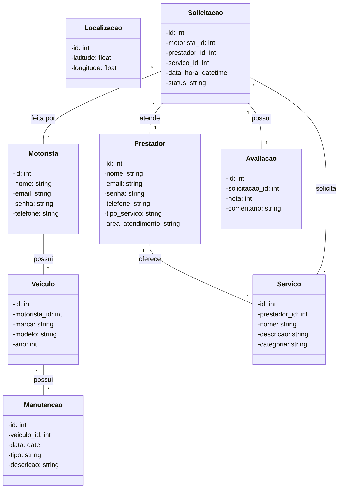

```mermaid

classDiagram
    class Motorista {
        -id: int
        -nome: string
        -email: string
        -senha: string
        -telefone: string
    }
    class Veiculo {
        -id: int
        -motorista_id: int
        -marca: string
        -modelo: string
        -ano: int
    }
    class Manutencao {
        -id: int
        -veiculo_id: int
        -data: date
        -tipo: string
        -descricao: string
    }
    class Prestador {
        -id: int
        -nome: string
        -email: string
        -senha: string
        -telefone: string
        -tipo_servico: string
        -area_atendimento: string
    }
    class Servico {
        -id: int
        -prestador_id: int
        -nome: string
        -descricao: string
        -categoria: string
    }
    class Localizacao {
        -id: int
        -latitude: float
        -longitude: float
    }
    class Solicitacao {
        -id: int
        -motorista_id: int
        -prestador_id: int
        -servico_id: int
        -data_hora: datetime
        -status: string
    }
    class Avaliacao {
        -id: int
        -solicitacao_id: int
        -nota: int
        -comentario: string
    }

    Motorista "1" -- "*" Veiculo : possui
    Veiculo "1" -- "*" Manutencao : possui
    Prestador "1" -- "*" Servico : oferece
    Solicitacao "1" -- "1" Avaliacao : possui
    Solicitacao "*" -- "1" Motorista : feita por
    Solicitacao "*" -- "1" Prestador : atende
    Solicitacao "*" -- "1" Servico : solicita

```
