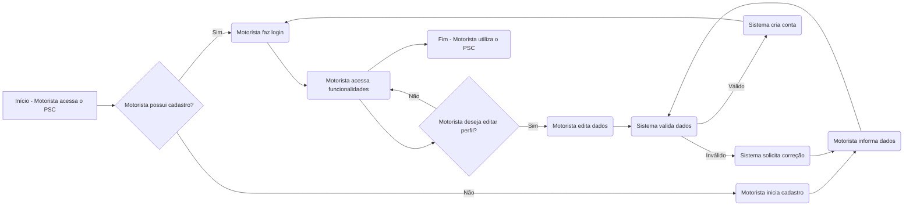
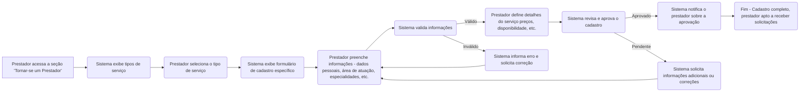
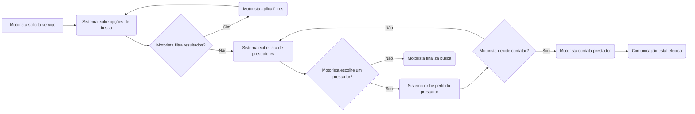
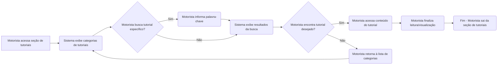
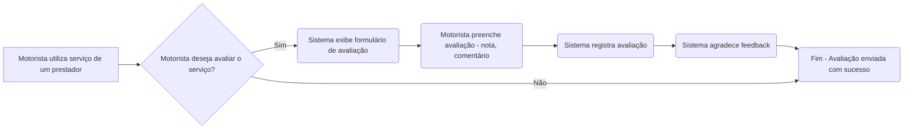
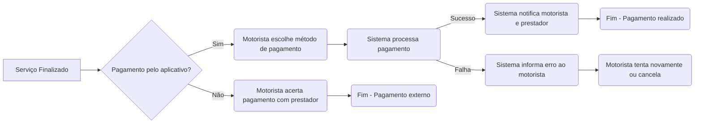
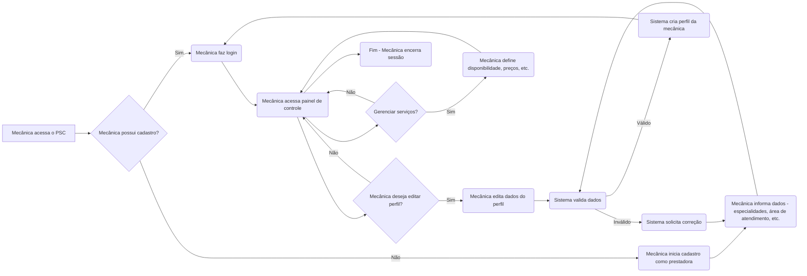
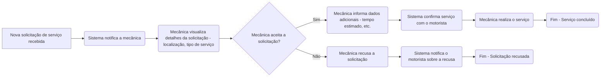
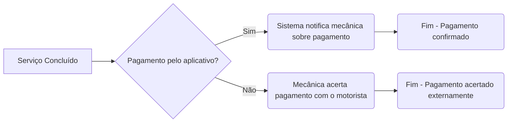

  
    
# FLUXOS: *NEXT HELP* ❇️

----
# Cadastro de consumidor

# Cadastro de Prestadores de Serviço

# Busca e Contato com Prestadores de Serviços

#  Acesso a Tutoriais de Autoajuda

# Cadastro de Tutoriais

```mermaid
graph LR
    A[Criador acessa painel administrativo] --> B(Sistema exibe opção 'Criar Tutorial')
    B --> C(Criador escolhe categoria)
    C --> D(Sistema exibe formulário de cadastro)
    D --> E(Criador preenche informações do tutorial)
    E --> F{Vídeo?}
    F -- Sim --> G(Criador envia vídeo)
    G --> H(Sistema valida aspectos técnicos e legais do vídeo)
    H -- Válido --> I(Criador adiciona conteúdo - texto, imagens)
    H -- Inválido --> M(Sistema informa erro e solicita novo envio)
    M --> G
    F -- Não --> I
    I --> J(Sistema publica tutorial com aviso 'Em Avaliação') 
    J --> K{Motoristas interagem com o vídeo?}
    K -- Sim --> L(Sistema atualiza Pontuação de Credibilidade)
    L --> N{Pontuação alta?}
    N -- Sim --> O(Vídeo destacado e recomendado)
    N -- Não --> P(Vídeo disponível normalmente)
    K -- Não --> P
    O --> P
```

#  Avaliação de Prestadores e Feedback

# Gerenciamento de Pagamento

# Cadastro e Gestão de Perfil da Mecânica

# Recebimento e Gestão de Solicitações de Serviço

# Acompanhamento de Pagamentos

