## Legenda ❇️:

* **Motorista - Motorista**
* **Prestador de Serviço - Prestador de Serviços** 
* **Sistema PSC - Sistema**
* **Admin/Financeiro - Admin/Financeiro** - Representa o time interno responsável por funções administrativas e financeiras.

## Fluxos ❇️:

**1. Cadastro de Consumidor:**

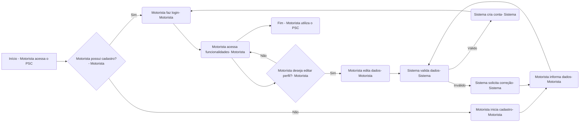

**2. Cadastro de Prestadores de Serviço:**

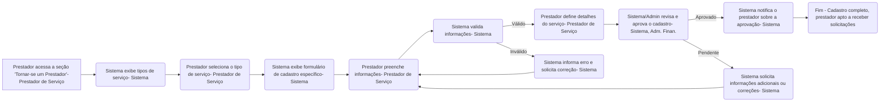

**3. Busca e Contato com Prestadores de Serviços:**

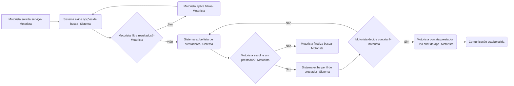

**4. Acesso a Tutoriais de Autoajuda:**

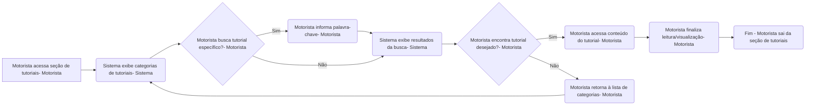
**5. Cadastro de Tutoriais:**

```mermaid
graph LR
    A[Criador acessa painel administrativo- Admin/Financeiro] --> B(Sistema exibe opção 'Criar Tutorial'- Sistema)
    B --> C(Criador escolhe categoria- Admin/Financeiro)
    C --> D(Sistema exibe formulário de cadastro- Sistema)
    D --> E(Criador preenche informações do tutorial- Admin/Financeiro)
    E --> F{Vídeo?-Sistema}
    F -- Sim --> G(Criador envia vídeo- Admin/Financeiro)
    G --> H(Sistema valida aspectos técnicos e legais do vídeo- Sistema)
    H -- Válido --> I(Criador adiciona conteúdo - texto, imagens- Admin/Financeiro)
    H -- Inválido --> M(Sistema informa erro e solicita novo envio- Sistema)
    M --> G
    F -- Não --> I
    I --> J(Sistema publica tutorial com aviso 'Em Avaliação'- Sistema) 
    J --> K{Motoristas interagem com o vídeo?- Motorista}
    K -- Sim --> L(Sistema atualiza Pontuação de Credibilidade- Sistema)
    L --> N{Pontuação alta?-Sistema}
    N -- Sim --> O(Vídeo destacado e recomendado- Sistema)
    N -- Não --> P(Vídeo disponível normalmente- Sistema)
    K -- Não --> P
    O --> P
```

**6. Avaliação de Prestadores e Feedback:**

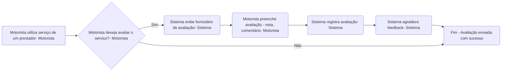

**7. Gerenciamento de Pagamento:**

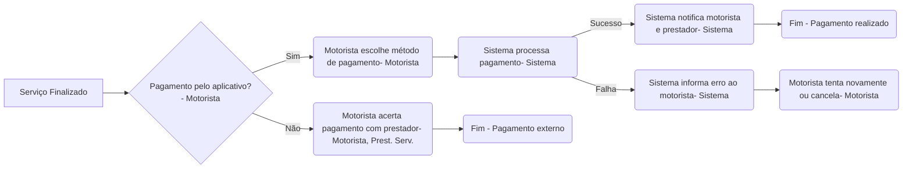

**8. Cadastro e Gestão de Perfil da Mecânica:**

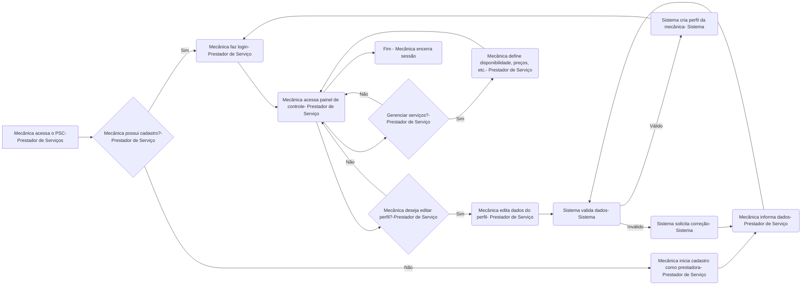

**9. Recebimento e Gestão de Solicitações de Serviço:**

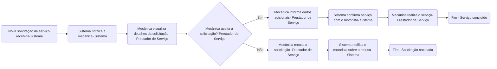

**10. Acompanhamento de Pagamentos:**

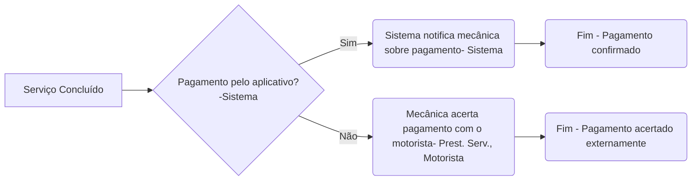

**11.  Emissão de Nota Fiscal e Faturamento:**

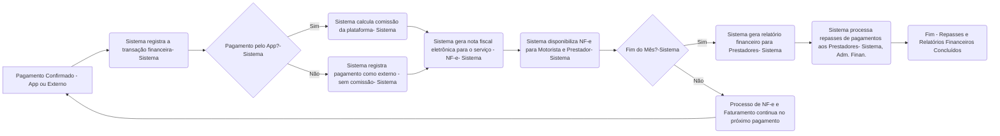
