Perfeito! Vamos adicionar os atores e os fluxos de emissão de nota fiscal e faturamento aos seus diagramas.

## **Legenda:**

* **Motorista - Motorista**
* **Prestador de Serviço - Prestador de Serviços** 
* **Sistema PSC - Sistema**
* **Admin/Financeiro - Admin/Financeiro** - Representa o time interno responsável por funções administrativas e financeiras.

## Fluxos Completos:

**1. Cadastro de Consumidor:**

```mermaid
graph LR
    A[Início - Motorista acessa o PSC] --> B{Motorista possui cadastro?- Motorista}
    B -- Sim --> C(Motorista faz login- Motorista)
    B -- Não --> D(Motorista inicia cadastro- Motorista)
    D --> E(Motorista informa dados- Motorista)
    E --> F(Sistema valida dados- Sistema)
    F -- Válido --> G(Sistema cria conta- Sistema)
    G --> C
    F -- Inválido --> H(Sistema solicita correção- Sistema)
    H --> E
    C --> I(Motorista acessa funcionalidades- Motorista)
    I --> J{Motorista deseja editar perfil?- Motorista}
    J -- Sim --> K(Motorista edita dados- Motorista)
    K --> F
    J -- Não --> I
    I --> L(Fim - Motorista utiliza o PSC)
```

**2. Cadastro de Prestadores de Serviço:**

```mermaid
graph LR
    A[Prestador acessa a seção 'Tornar-se um Prestador'-Prestador de Serviço] --> B(Sistema exibe tipos de serviço- Sistema)
    B --> C(Prestador seleciona o tipo de serviço- Prestador de Serviço)
    C --> D(Sistema exibe formulário de cadastro específico- Sistema)
    D --> E(Prestador preenche informações- Prestador de Serviço)
    E --> F(Sistema valida informações- Sistema)
    F -- Válido --> G(Prestador define detalhes do serviço- Prestador de Serviço)
    G --> H(Sistema/Admin revisa e aprova o cadastro- Sistema, Adm. Finan.)
    H -- Aprovado --> I(Sistema notifica o prestador sobre a aprovação- Sistema)
    I --> J(Fim - Cadastro completo, prestador apto a receber solicitações)
    H -- Pendente --> K(Sistema solicita informações adicionais ou correções- Sistema)
    K --> E
    F -- Inválido --> L(Sistema informa erro e solicita correção- Sistema)
    L --> E
```

**3. Busca e Contato com Prestadores de Serviços:**

```mermaid
graph LR
    A[Motorista solicita serviço- Motorista] --> B(Sistema exibe opções de busca- Sistema)
    B --> C{Motorista filtra resultados?- Motorista}
    C -- Sim --> D(Motorista aplica filtros- Motorista)
    D --> B
    C -- Não --> E(Sistema exibe lista de prestadores- Sistema)
    E --> F{Motorista escolhe um prestador?- Motorista}
    F -- Sim --> G(Sistema exibe perfil do prestador- Sistema)
    G --> H{Motorista decide contatar?- Motorista}
    H -- Sim --> I(Motorista contata prestador - via chat do app- Motorista)
    H -- Não --> E
    F -- Não --> J(Motorista finaliza busca- Motorista)
    I --> K(Comunicação estabelecida)
```

**4. Acesso a Tutoriais de Autoajuda:**

```mermaid
graph LR
    A[Motorista acessa seção de tutoriais- Motorista] --> B(Sistema exibe categorias de tutoriais- Sistema)
    B --> C{Motorista busca tutorial específico?- Motorista}
    C -- Sim --> D(Motorista informa palavra-chave- Motorista)
    D --> E(Sistema exibe resultados da busca- Sistema)
    C -- Não --> E
    E --> F{Motorista encontra tutorial desejado?- Motorista}
    F -- Sim --> G(Motorista acessa conteúdo do tutorial- Motorista)
    G --> H(Motorista finaliza leitura/visualização- Motorista)
    F -- Não --> I(Motorista retorna à lista de categorias- Motorista)
    I --> B
    H --> J(Fim - Motorista sai da seção de tutoriais)
```
**5. Cadastro de Tutoriais:**

```mermaid
graph LR
    A[Criador acessa painel administrativo- Admin/Financeiro] --> B(Sistema exibe opção 'Criar Tutorial'- Sistema)
    B --> C(Criador escolhe categoria- Admin/Financeiro)
    C --> D(Sistema exibe formulário de cadastro- Sistema)
    D --> E(Criador preenche informações do tutorial- Admin/Financeiro)
    E --> F{Vídeo?-Sistema}
    F -- Sim --> G(Criador envia vídeo- Admin/Financeiro)
    G --> H(Sistema valida aspectos técnicos e legais do vídeo- Sistema)
    H -- Válido --> I(Criador adiciona conteúdo - texto, imagens- Admin/Financeiro)
    H -- Inválido --> M(Sistema informa erro e solicita novo envio- Sistema)
    M --> G
    F -- Não --> I
    I --> J(Sistema publica tutorial com aviso 'Em Avaliação'- Sistema) 
    J --> K{Motoristas interagem com o vídeo?- Motorista}
    K -- Sim --> L(Sistema atualiza Pontuação de Credibilidade- Sistema)
    L --> N{Pontuação alta?-Sistema}
    N -- Sim --> O(Vídeo destacado e recomendado- Sistema)
    N -- Não --> P(Vídeo disponível normalmente- Sistema)
    K -- Não --> P
    O --> P
```

**6. Avaliação de Prestadores e Feedback:**

```mermaid
graph LR
    A[Motorista utiliza serviço de um prestador- Motorista] --> B{Motorista deseja avaliar o serviço?- Motorista}
    B -- Sim --> C(Sistema exibe formulário de avaliação- Sistema)
    C --> D(Motorista preenche avaliação - nota, comentário- Motorista)
    D --> E(Sistema registra avaliação- Sistema)
    E --> F(Sistema agradece feedback- Sistema)
    F --> G(Fim - Avaliação enviada com sucesso)
    B -- Não --> G
```

**7. Gerenciamento de Pagamento:**

``` mermaid
graph LR
    A[Serviço Finalizado] --> B{Pagamento pelo aplicativo?- Motorista}
    B -- Sim --> C(Motorista escolhe método de pagamento- Motorista)
    C --> D(Sistema processa pagamento- Sistema)
    D -- Sucesso --> E(Sistema notifica motorista e prestador- Sistema)
    D -- Falha --> F(Sistema informa erro ao motorista- Sistema)
    E --> G(Fim - Pagamento realizado)
    F --> H(Motorista tenta novamente ou cancela- Motorista)
    B -- Não --> I(Motorista acerta pagamento com prestador- Motorista, Prest. Serv.)
    I --> J(Fim - Pagamento externo) 
```

**8. Cadastro e Gestão de Perfil da Mecânica:**

```mermaid
graph LR
    A[Mecânica acessa o PSC-Prestador de Serviços] --> B{Mecânica possui cadastro?-Prestador de Serviço}
    B -- Sim --> C(Mecânica faz login- Prestador de Serviço)
    B -- Não --> D(Mecânica inicia cadastro como prestadora- Prestador de Serviço)
    D --> E(Mecânica informa dados- Prestador de Serviço)
    E --> F(Sistema valida dados- Sistema)
    F -- Válido --> G(Sistema cria perfil da mecânica- Sistema)
    G --> C
    F -- Inválido --> H(Sistema solicita correção- Sistema)
    H --> E
    C --> I(Mecânica acessa painel de controle- Prestador de Serviço)
    I --> J{Mecânica deseja editar perfil?-Prestador de Serviço}
    J -- Sim --> K(Mecânica edita dados do perfil- Prestador de Serviço)
    K --> F
    J -- Não --> I
    I --> L{Gerenciar serviços?-Prestador de Serviço}
    L -- Sim --> M(Mecânica define disponibilidade, preços, etc.- Prestador de Serviço)
    L -- Não --> I
    M --> I
    I --> N(Fim - Mecânica encerra sessão)
```

**9. Recebimento e Gestão de Solicitações de Serviço:**

```mermaid
graph LR
    A[Nova solicitação de serviço recebida-Sistema] --> B(Sistema notifica a mecânica- Sistema)
    B --> C(Mecânica visualiza detalhes da solicitação- Prestador de Serviço)
    C --> D{Mecânica aceita a solicitação?-Prestador de Serviço}
    D -- Sim --> E(Mecânica informa dados adicionais- Prestador de Serviço)
    E --> F(Sistema confirma serviço com o motorista- Sistema)
    F --> G(Mecânica realiza o serviço- Prestador de Serviço)
    G --> H(Fim - Serviço concluído)
    D -- Não --> I(Mecânica recusa a solicitação- Prestador de Serviço)
    I --> J(Sistema notifica o motorista sobre a recusa- Sistema)
    J --> K(Fim - Solicitação recusada) 
```

**10. Acompanhamento de Pagamentos:**

```mermaid
graph LR
    A[Serviço Concluído] --> B{Pagamento pelo aplicativo?-Sistema}
    B -- Sim --> C(Sistema notifica mecânica sobre pagamento- Sistema)
    C --> D(Fim - Pagamento confirmado)
    B -- Não --> E(Mecânica acerta pagamento com o motorista- Prest. Serv., Motorista)
    E --> F(Fim - Pagamento acertado externamente)
```

**11.  Emissão de Nota Fiscal e Faturamento:**

```mermaid
graph LR
    A[Pagamento Confirmado - App ou Externo] --> B(Sistema registra a transação financeira- Sistema)
    B --> C{Pagamento pelo App?-Sistema}
    C -- Sim --> D(Sistema calcula comissão da plataforma- Sistema)
    C -- Não --> E(Sistema registra pagamento como externo - sem comissão- Sistema)
    D --> F(Sistema gera nota fiscal eletrônica para o serviço - NF-e- Sistema)
    E --> F
    F --> G(Sistema disponibiliza NF-e para Motorista e Prestador- Sistema)
    G --> H{Fim do Mês?-Sistema}
    H -- Sim --> I(Sistema gera relatório financeiro para Prestadores- Sistema)
    I --> J(Sistema processa repasses de pagamentos aos Prestadores- Sistema, Adm. Finan.)
    H -- Não --> K(Processo de NF-e e Faturamento continua no próximo pagamento)
    J --> L(Fim - Repasses e Relatórios Financeiros Concluídos)
    K --> A
```

Com os atores, processos de pagamento, emissão de NF-e e  faturamento mapeados, você tem uma visão mais completa do funcionamento do seu sistema. 😉 
